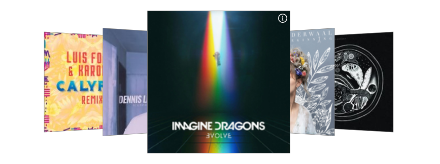

# Last.fm Plugin

**Last.fm** is a plugin for [Grav](http://github.com/getgrav/grav) that adds a scrobbling list of your latest played songs thanks to [Last.fm](https://last.fm) API.



## Installation

Installing the Last.fm plugin can be done in one of two ways. The GPM (Grav Package Manager) installation method enables you to quickly and easily install the plugin with a simple terminal command, while the manual method enables you to do so via a zip file.

### GPM Installation (Preferred)

The simplest way to install this plugin is via the [Grav Package Manager (GPM)](http://learn.getgrav.org/advanced/grav-gpm) through your system's terminal. From the root of your Grav folder type:

    bin/gpm install lastfm

This will install Last.fm into your `/user/plugins` directory within Grav. Its files can be found under `/your/site/grav/user/plugins/lastfm`.

### Manual Installation

To install this plugin, just download the zip version of this repository and unzip it under `/your/site/grav/user/plugins`. Then, rename the folder to `lastfm`. You can find these files on [GitHub](https://github.com/ayozehd/lastfm) or via [GetGrav.org](http://getgrav.org/downloads/plugins#extras).

You should now have all the plugin files under

    /your/site/grav/user/plugins/lastfm


## Usage

Include this line in your template.html.twig file:
```

```

Otherwise you can use a function which returns same results:
```
{{ lastfm() }}
```

### Settings

| Variable | Default | Options | Note |
|----------|---------|-------------------------------------------------|-----------------------------------------------------------------------|
| enabled | true | `true` or `false` | Enables or disables the plugin. |
| built_in_css | true | `true` or `false` | Disable plugin CSS. |
| lastfm_user | null | `username` | Your Last.fm username (*) |
| api_key | null | `xxx` | Create an [API Account](https://www.last.fm/api/account/create) and get your API Key (*) |
| image_size | `medium` | `small`, `medium`, `large`  or `extralarge` | Set an image size for latest song album |
| limit | 10 | `int` < 50 | Max 50 tracks allowed by Last.fm |
| cache_lifetime | 500 | `int` (seconds) | How much long should keep data stored in cache |

(*) Required

## Extending

Use a SCSS-compiler, like LibSass, and compile assets/scss/lastfm.scss to your assets in the plugin-folder. For example: `sass --watch --source-map true assets/scss/lastfm.scss assets/scss/lastfm.css`.

## License

See [LICENSE](LICENSE)